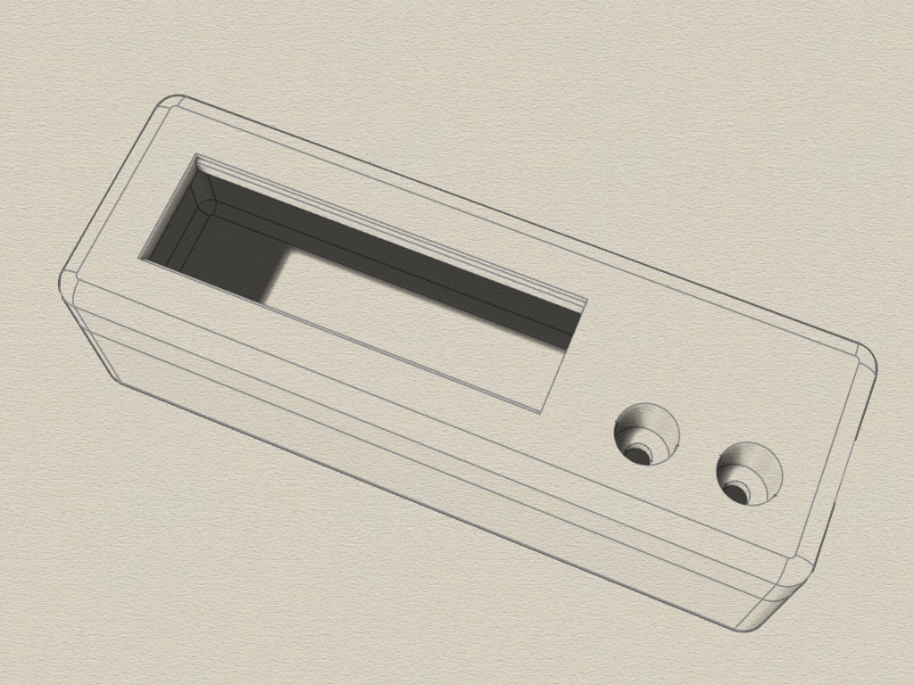
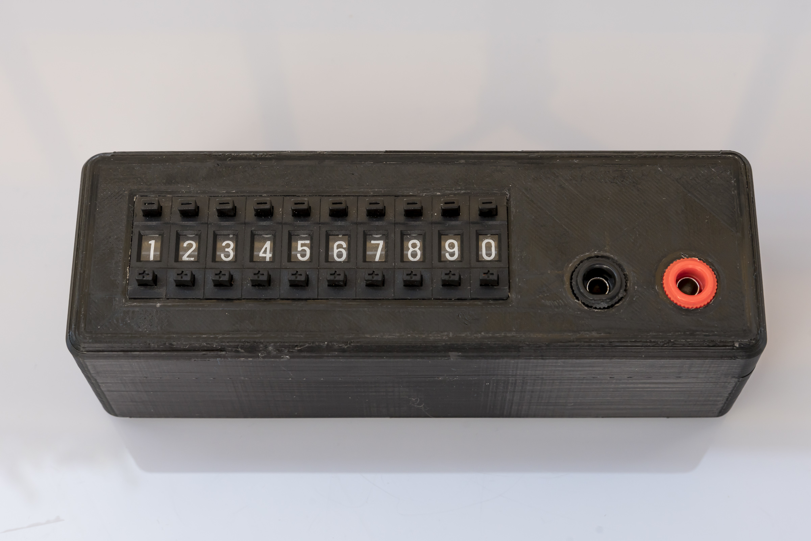
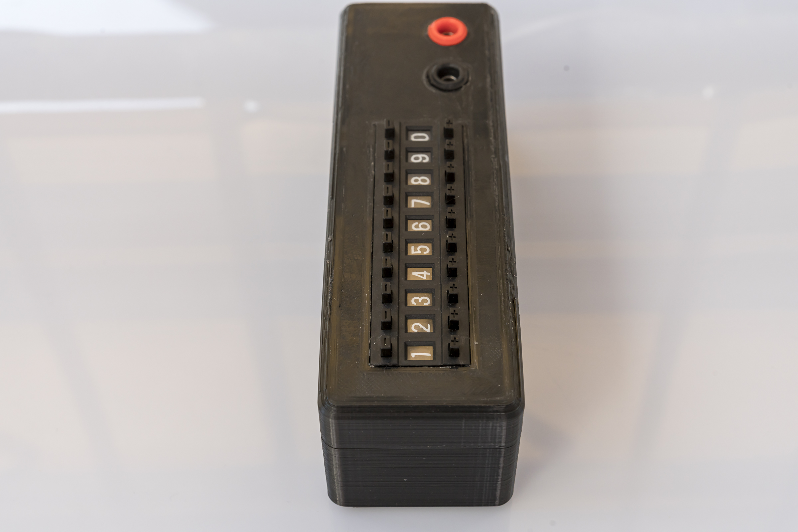
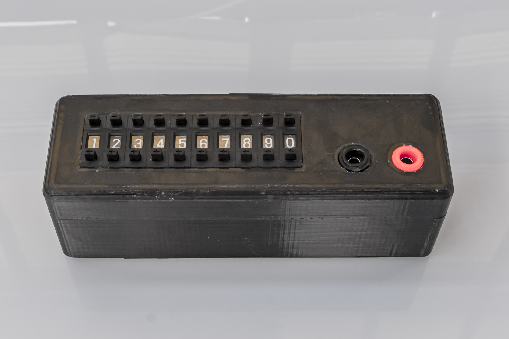
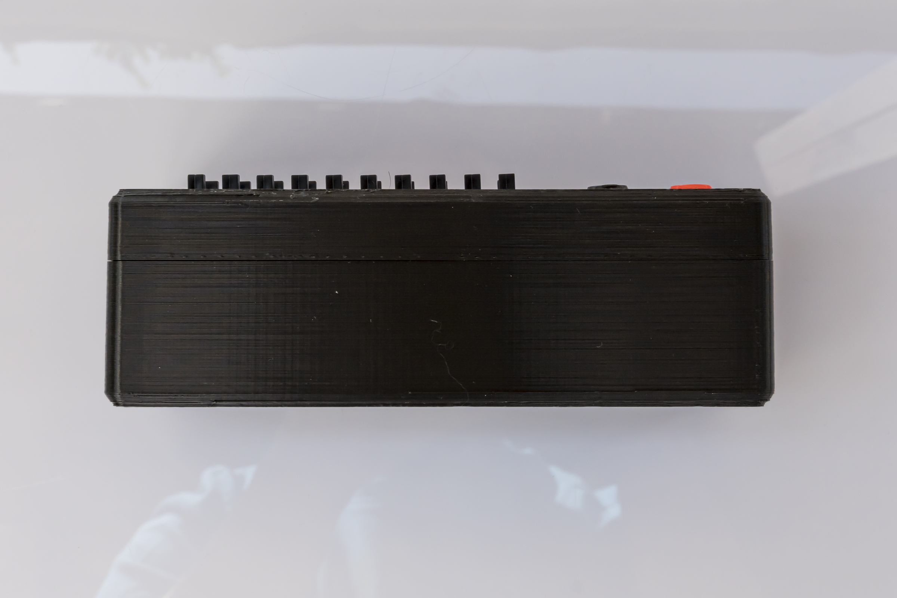
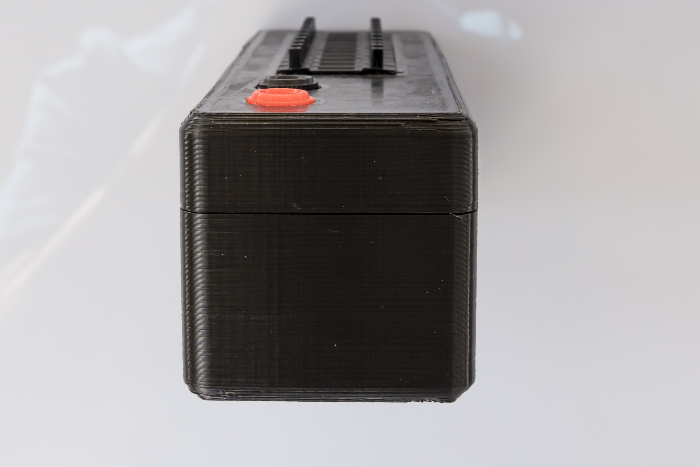
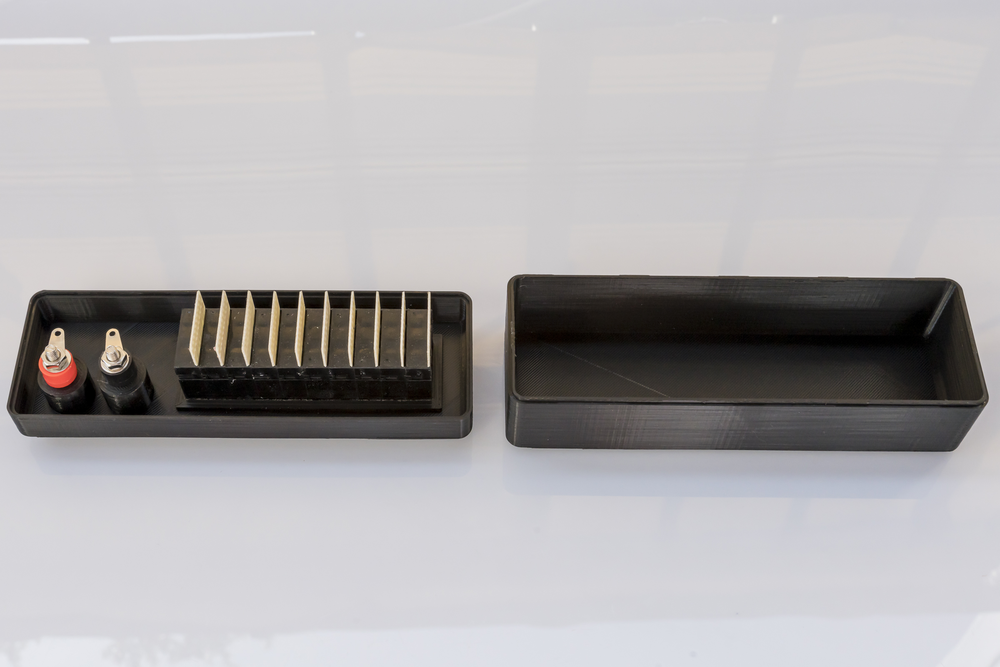
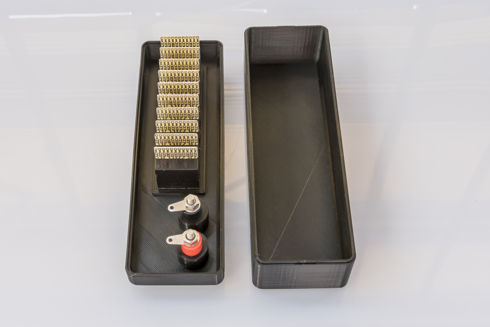

# Resistor-decade
3D printable Case for tumble wheel resistor decade.

## 3D Case

The enclosure consists of 2 parts. No screws needed. 

Requirements:
* 3D printer 
* Filament of your choice
* Tumble wheels (aliexpress)
* Resistors, 2 Banana-Jacks, Solder, Soldering Iron.

## View

